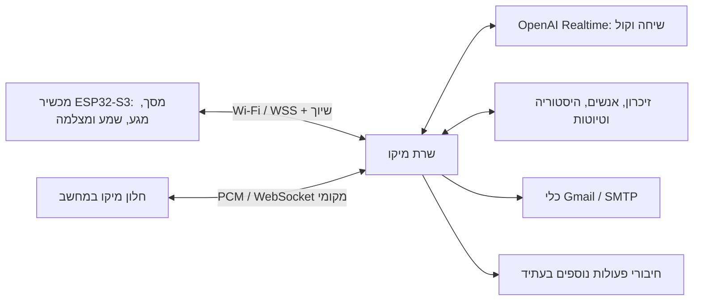
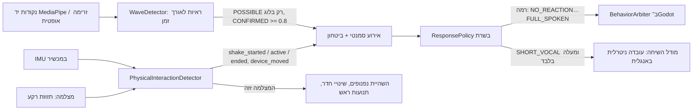

# המבנה החדש של מיקו

המכשיר הוא הבית והתצוגה של מיקו. זהותו, הזיכרון והפעולות נשמרים בשרת.
החלפת מכשיר או ניתוק Wi-Fi אינם יוצרים בעלים חדש או מאפסים זיכרון.
בתוך חיבור פעיל, כל לחיצה לדיבור ממשיכה באותה שיחת Realtime. לאחר ניתוק,
המושב הלוגי נשמר, והחיבור למודל נפתח מחדש עם זיכרון והקשר שנשמרו בשרת.

## מה כבר ממומש

| חלק | מימוש |
|---|---|
| קול ושיחה | Realtime, PCM16 מונו 24kHz, תגובות קוליות זורמות וכלים בשרת |
| זהות מכשיר | שיוך בעלים יחיד, TLS ובדיקת HMAC עם אתגר חדש לכל חיבור |
| חיבור מחדש | סיום החיבור הקודם לפני שיוך התעבורה למושב הקיים |
| קטיעת דיבור | פינוי שמע ממתין, ביטול תשובה ושמירת מיקום השמע שנוגן |
| מסך קטן | שמונה נכסי 240×280: הקשבה, דיבור, שינה, שמחה ומצמוץ |
| מצלמה | בקשה נוכחית של המשתמש ואישור פיזי לתמונה יחידה; ללא שמירת תמונה |
| ראייה | מצלמת המחשב (ובעתיד מצלמת המכשיר) מעובדת מקומית בזיכרון: נוכחות, מיקום, נפנוף מאומת, טלטול, הגעה ועזיבה. בלי שמירה ובלי שליחה ל־OpenAI. F7 מכבה. |
| תנועת מכשיר | IMU (פריים `05`, יכולת `motion`): טלטול, הזזה והיפוך, גם כשהמצלמה כבויה |
| פקודות גוף | הכלי miko_perform_action: ללכת לכל כיוון, לבוא, לקפוץ, לנופף, לשבת, לרקוד, לעצור. Godot מבצע, והמכשיר מקבל רמז gesture |
| זיכרון | נתונים קיימים נשמרים; תור, מספר תור ומושב מלווים את התמלול |
| Gmail | חיבור SMTP הקיים; טיוטה, הצגה ואישור טרי לפני שליחה אמיתית |

## תפיסה, החלטה ותגובה (17.6)

* **פעולה פיזית אחת = אירוע אחד.** `miko_physical.py` מחשב מכל פריים את
  תזוזת הרקע (בלי האדם שמול המצלמה, ורק כשיש לרקע מרקם), ומעביר אותה דרך
  אזור מת, החלקה, היסטרזיס, משכי מינימום, ספירת הלוך־חזור עקבית ותקופת
  צינון אחרי טלטול. התוצאה: `shake_started` אחד, `shake_active` לכל היותר
  פעם בשנייה, ו־`shake_ended` אחד. תזוזה קטנה, הקלדה או רעידת מכסה הן
  `device_nudged` או `device_moved` בלבד, בלי מילים. ה־IMU של המכשיר (פריים
  `05`) משתמש באותה לוגיקה ומחליף את המצלמה כמקור טלטול כשהוא מחובר.
* **נפנוף אמיתי בלבד.** `miko_gestures.py` אוסף ראיות לאורך כ־2.4 שניות: יד
  פתוחה ומורמת, לפחות שלוש החלפות כיוון בקצב של יד, כיסוי מעקב מספיק, תנועה
  צידית ולא אנכית, מצלמה יציבה, וראש שלא זז יחד עם היד. ביטחון חלקי נרשם
  בלוג כ־POSSIBLE_WAVE ולא מפעיל כלום. רק CONFIRMED_WAVE (ביטחון 0.8 ומעלה,
  וכל השערים עברו) הופך לאירוע. נפנוף ממושך נחשב נפנוף אחד, ונפנוף חדש
  דורש הפסקה וצינון. עם MediaPipe, זרימה אופטית לבדה לעולם לא מאשרת נפנוף.
* **מדיניות תגובה** (`miko_behavior.py`): לכל אירוע נקבעת רמה, לפי סוג,
  ביטחון, עוצמה, חידוש, חזרה, תקציב חברתי (משפט אחד לכל היותר כל 25 שניות)
  והקשר. השיחה קודמת לחיישנים: כשהבעלים מדבר או מיקו עונה, אירוע קטן
  מקבל לכל היותר מבט. מילים נאמרות רק ברמה SHORT_VOCAL ומעלה.
* **הגוף** (`characters/robot/behavior_arbiter.gd`): הרמה מהשרת היא תקרה.
  ב־Godot נבדקים עדיפות, משך מינימלי של מחווה שכבר רצה, צינון לכל משפחת
  תנועות, עונש על חזרה בדקה האחרונה, והחרגה של התנהגות אוטונומית (למשל
  נפנוף "סתם" מיד אחרי תגובה לנפנוף אמיתי). פנים משקפות פנים גם כשהגוף
  נשאר במקום.
* **עברית.** ההערות למודל כתובות באנגלית ניטרלית, כדי שהמודל לא יעתיק
  וישבש מילים (כך נוצר "איזה נופף חמוד"). `miko_language.py` מסמן בלוג מילים
  מומצאות, משפטים קבועים, תיאור חיישנים וחזרה על פתיחים, והפתיחים האחרונים
  נמסרים למודל כאסורים בתגובה הספונטנית הבאה.

## יציאה מכל מצב תקוע (17.6)

| מצב | יציאה דטרמיניסטית | לוג |
|---|---|---|
| תשובה שלא התחילה | בקשה חוזרת אחרי 7 שניות, ושחרור החלון אחרי 14 | `RECOVERY` |
| תשובה שהתחילה ונדמה | ביטול ושחרור אחרי 30 שניות בלי אירועים | `RECOVERY` |
| תשובה שנכשלה בלי שמע (TTS) | החלון חוזר מיד ל"אפשר לדבר" | `BRAIN`, `RECOVERY` |
| תמלול שנכשל | המודל עונה מהשמע עצמו; רק הכיתוב חסר | `STT` |
| commit שנדחה | התור משתחרר מיד (או אחרי 15 שניות) | `RECOVERY` |
| תגובה ספונטנית שלא התחילה | משתחררת אחרי 15 שניות | `RECOVERY` |
| הגוף נתקע בשלב עדכון | שומר דופק מזהה את השלב ומאפס לתנועה רגועה | `RECOVERY` |
| ערך גוף לא סופי (NaN) | איפוס מיידי של המיקום והכיוון | `RECOVERY` |
| חושב/מתחבר/מסיים זמן רב מדי | איפוס מצב הקול בחלון | `RECOVERY` |
| הלולאה הראשית נעצרה | חוט שמירה רושם כמה זמן ובאיזה מצב | `RECOVERY` |
| פריימים איטיים | הורדת איכות רינדור בשלבים | `PERF` |
| "נשלח" בלי הצלחה אמיתית | השרת מוסיף עובדה ומבקש תיקון קצר מיד | `EMAIL` |

הלוגים בפורמט `שעה קטגוריה: הודעה מפתח=ערך`, בקטגוריות PERCEPTION, GESTURE,
PHYSICAL, BEHAVIOR, ANIMATION, BRAIN, STT, TTS, ACTION, EMAIL, RECOVERY,
LANGUAGE ו־PERF. ערכי פריים בודדים נרשמים רק עם `MIKO_VISION_DEBUG=1`.
אין בלוגים סיסמאות, אסימונים או תוכן מיילים.

## התצוגה והנוכחות

המודל המקורי של מיקו נשמר, עם שיפור חומרי PBR, תאורה, צללים וסצנת בית חדשה.
התנועה נשארת קטנה וממוקדת: מבט, מצמוץ, הטיה בזמן הקשבה וקצב גוף בזמן קול.
המודל והרקע אינם סריקות מציאות פוטוריאליסטיות. ESP32 מציג תמונות שנוצרו
מהתלת־ממד ומשלב מצבי מסך קלים; העיבוד המלא של Godot נשאר במחשב.

## מה נשאר לשלב החומרה

לוח [Waveshare 1.69](https://docs.waveshare.com/ESP32-S3-Touch-LCD-1.69)
כולל LCD, מגע, IMU ו־Wi-Fi. המשאבים המפורסמים כוללים זמזם, ומיקרופון,
מגבר/רמקול לדיבור ומצלמה יצטרכו חומרה חיצונית או לוח מותאם. צריך לבחור
רכיבים ולבדוק פינים פנויים, צריכת חשמל, איכות השמע ומיקום המיקרופון.

`device/firmware/main/miko_board.h` מגדיר את החוזה עם החומרה.
`miko_board_stub.c` לא מפעיל רשת או התקן דמיוני. לאחר בחירת הרכיבים יש לממש
את המתאם, לבנות עם ESP-IDF, לצרוב ולבדוק על הלוח. לא בוצעה בדיקה פיזית.

Push-to-talk הוא מצב ההתחלה. שיחה חופשית במכשיר תצריך ביטול הד עם אות
ייחוס של הרמקול. [Espressif AFE](https://docs.espressif.com/projects/esp-sr/en/latest/esp32s3/audio_front_end/README.html)
מספק AEC/VAD במבנה שמע 16kHz; מתאם כזה יצטרך גם המרה ל־24kHz של הפרוטוקול.

## שרת עצמאי בעתיד

החיבור למכשיר נפרד משרת הדפדפן המקומי, ולכן ניתן להעביר אותו לשרת קבוע.
כדי לעבוד מחוץ לבית בלי מחשב אישי דולק צריך אירוח נגיש, שם מתחם ותעודה,
אחסון מגובה, ניהול זהות בעלים וחיבורי חשבונות. אלה עדיין לא נפרסו.
חיבור Gmail הקיים מוצפן ב־Windows DPAPI; הוא נשמר במחשב הנוכחי. העברה
למערכת שרת אחרת תצריך הגדרת אחסון סודות וחיבור Gmail שם, בלי להעתיק סיסמה
למכשיר. מוצר למספר משתמשים יצריך בידוד חשבונות ונתונים לכל בעלים.

WhatsApp אינו מחובר. חיבור עתידי יתווסף לכלים בשרת רק לאחר הגדרת ספק,
חשבון והרשאות. שום מכשיר אינו מחליט בעצמו שאישור שליחה התקבל.
