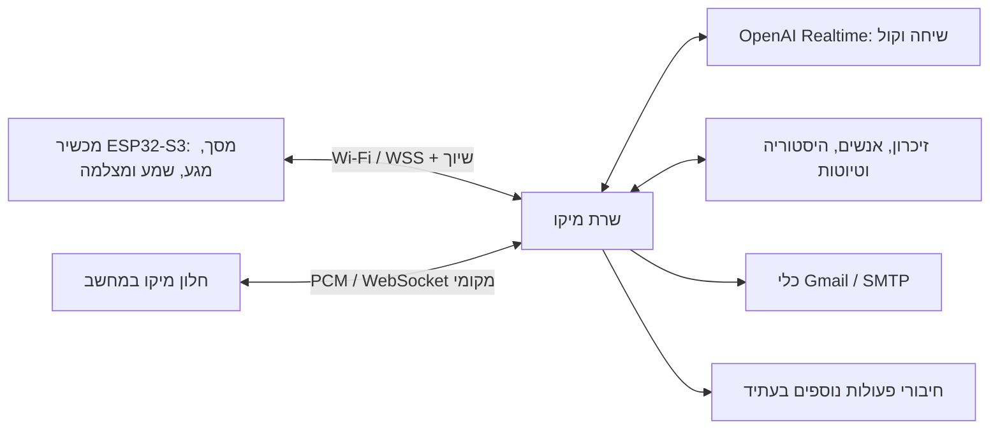

# המבנה החדש של מיקו

המכשיר הוא הבית והתצוגה של מיקו. זהותו, הזיכרון והפעולות נשמרים בשרת.
החלפת מכשיר או ניתוק Wi-Fi אינם יוצרים בעלים חדש או מאפסים זיכרון.
בתוך חיבור פעיל, כל לחיצה לדיבור ממשיכה באותה שיחת Realtime. לאחר ניתוק,
המושב הלוגי נשמר, והחיבור למודל נפתח מחדש עם זיכרון והקשר שנשמרו בשרת.

## מה כבר ממומש

| חלק | מימוש |
|---|---|
| קול ושיחה | Realtime, PCM16 מונו 24kHz, תגובות קוליות זורמות וכלים בשרת |
| זהות מכשיר | שיוך בעלים יחיד, TLS ובדיקת HMAC עם אתגר חדש לכל חיבור |
| חיבור מחדש | סיום החיבור הקודם לפני שיוך התעבורה למושב הקיים |
| קטיעת דיבור | פינוי שמע ממתין, ביטול תשובה ושמירת מיקום השמע שנוגן |
| מסך קטן | שמונה נכסי 240×280: הקשבה, דיבור, שינה, שמחה ומצמוץ |
| מצלמה | בקשה נוכחית של המשתמש ואישור פיזי לתמונה יחידה; ללא שמירת תמונה |
| זיכרון | נתונים קיימים נשמרים; תור, מספר תור ומושב מלווים את התמלול |
| Gmail | חיבור SMTP הקיים; טיוטה, הצגה ואישור טרי לפני שליחה אמיתית |

## התצוגה והנוכחות

המודל המקורי של מיקו נשמר, עם שיפור חומרי PBR, תאורה, צללים וסצנת בית חדשה.
התנועה נשארת קטנה וממוקדת: מבט, מצמוץ, הטיה בזמן הקשבה וקצב גוף בזמן קול.
המודל והרקע אינם סריקות מציאות פוטוריאליסטיות. ESP32 מציג תמונות שנוצרו
מהתלת־ממד ומשלב מצבי מסך קלים; העיבוד המלא של Godot נשאר במחשב.

## מה נשאר לשלב החומרה

לוח [Waveshare 1.69](https://docs.waveshare.com/ESP32-S3-Touch-LCD-1.69)
כולל LCD, מגע, IMU ו־Wi-Fi. המשאבים המפורסמים כוללים זמזם, ומיקרופון,
מגבר/רמקול לדיבור ומצלמה יצטרכו חומרה חיצונית או לוח מותאם. צריך לבחור
רכיבים ולבדוק פינים פנויים, צריכת חשמל, איכות השמע ומיקום המיקרופון.

`device/firmware/main/miko_board.h` מגדיר את החוזה עם החומרה.
`miko_board_stub.c` לא מפעיל רשת או התקן דמיוני. לאחר בחירת הרכיבים יש לממש
את המתאם, לבנות עם ESP-IDF, לצרוב ולבדוק על הלוח. לא בוצעה בדיקה פיזית.

Push-to-talk הוא מצב ההתחלה. שיחה חופשית במכשיר תצריך ביטול הד עם אות
ייחוס של הרמקול. [Espressif AFE](https://docs.espressif.com/projects/esp-sr/en/latest/esp32s3/audio_front_end/README.html)
מספק AEC/VAD במבנה שמע 16kHz; מתאם כזה יצטרך גם המרה ל־24kHz של הפרוטוקול.

## שרת עצמאי בעתיד

החיבור למכשיר נפרד משרת הדפדפן המקומי, ולכן ניתן להעביר אותו לשרת קבוע.
כדי לעבוד מחוץ לבית בלי מחשב אישי דולק צריך אירוח נגיש, שם מתחם ותעודה,
אחסון מגובה, ניהול זהות בעלים וחיבורי חשבונות. אלה עדיין לא נפרסו.
חיבור Gmail הקיים מוצפן ב־Windows DPAPI; הוא נשמר במחשב הנוכחי. העברה
למערכת שרת אחרת תצריך הגדרת אחסון סודות וחיבור Gmail שם, בלי להעתיק סיסמה
למכשיר. מוצר למספר משתמשים יצריך בידוד חשבונות ונתונים לכל בעלים.

WhatsApp אינו מחובר. חיבור עתידי יתווסף לכלים בשרת רק לאחר הגדרת ספק,
חשבון והרשאות. שום מכשיר אינו מחליט בעצמו שאישור שליחה התקבל.
